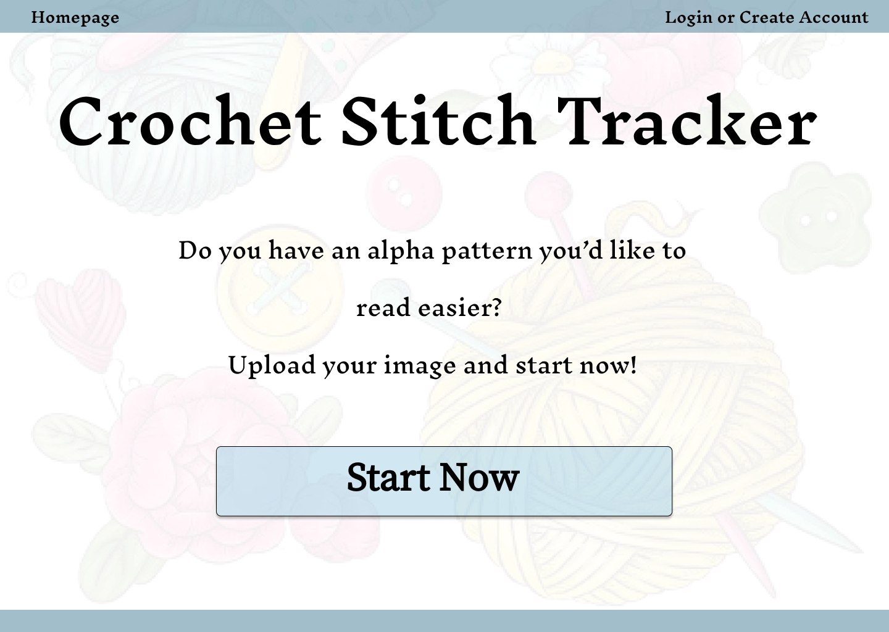

# Logic Planning

High-Level User Flow

1. **User lands on homepage** → Sees “Start Now” button  
2. **Clicks “Start Now”** → Redirects to project size selection  
3. **User selects a project size** → e.g., Small T-shirt (17” x 20”)

### ➡️ App calculates:
columns = width / 0.5
rows = height / 0.5
// For example: 17 / 0.5 = 34 columns, 20 / 0.5 = 40 rows

4. **User uploads an image
- Image is displayed on screen (resized if needed)
- App reads image’s pixel dimensions
- Image height capped at 800px (resize logic TBD)

5. Grid is generated:
- Fixed number of rows/columns from project size
- Each grid square = 1 stitch (0.5” x 0.5”)
- Grid overlays image and aligns with it

cellWidth = image.width / columns
cellHeight = image.height / rows

**Key Principles**
1. Grid size is based on project size, not image dimensions

2. Image dimensions are only for alignment

3. Users don’t need to understand the math—just choose a preset like “small shirt”

4. Grid aligns with image and shows progress row by row

**Math Example (Small T-shirt)**

Width: 17”
Height: 20”

Standard stitch: 0.5” per stitch

columns = 17 / 0.5 = 34
rows = 20 / 0.5 = 40

** When the user uploads an image:

Image gets resized (if over 800px height)

Grid is generated with 34 x 40 cells

Each grid cell is scaled to match image dimensions

cellWidth = image.width / 34
cellHeight = image.height / 40

**Conceptual Summary**
“The grid has a fixed number of cells.
The image can be any size—but once it’s displayed,
I divide its width and height by the number of grid columns and rows
so the grid stretches or shrinks to fit it exactly.”

